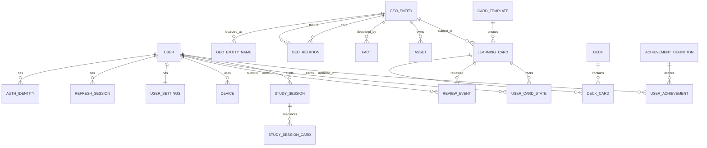

# Техническое задание для Backend Agent

Статус: `Implementation baseline 0.2`  
Стек: NestJS + PostgreSQL  
Зависимость: [00-product-spec.md](./00-product-spec.md)

## 1. Результат работы

Агент должен реализовать версионированный REST API, который:

- аутентифицирует пользователей через Apple и Google;
- хранит профиль, настройки и несколько auth identities;
- отдаёт версионируемый каталог географических сущностей, колод и карточек;
- формирует учебные сессии;
- идемпотентно принимает review, в том числе после офлайн-работы;
- рассчитывает интервальное повторение, прогресс, mastery и достижения;
- поддерживает `SELF_RATED` и `MULTIPLE_CHOICE` с единым журналом review;
- поддерживает удаление аккаунта;
- документирован OpenAPI и покрыт тестами.

Backend является источником истины для синхронизированных пользовательских данных и состояния планировщика.

## 2. Технические решения

### 2.1 Обязательный стек

- NestJS на актуальной поддерживаемой LTS-версии Node.js;
- TypeScript в strict mode;
- Yarn workspaces через Corepack с зафиксированными версией Yarn и `yarn.lock`;
- PostgreSQL;
- Prisma ORM и миграции;
- REST JSON под префиксом `/v1`;
- OpenAPI/Swagger, генерируемый из DTO;
- Jest для unit/integration тестов;
- Testcontainers или отдельная PostgreSQL test database для integration;
- Dockerfile и локальный `compose.yaml`;
- структурированные JSON-логи.

Версии зависимостей фиксируются lock-файлом без диапазонов для критических scheduler/auth dependencies. Нельзя использовать `prisma db push` или автоматическую синхронизацию схемы в production: изменения БД проходят миграциями.

### 2.2 Дополнительная инфраструктура

- S3-совместимое объектное хранилище и CDN для медиа.
- Redis MAY быть добавлен для rate limit, кэша, очередей и блокировок, но API не должен зависеть от него без необходимости.
- Фоновые импорты и уведомления SHOULD выполняться worker-процессом через очередь после появления такой нагрузки.

## 3. Модульная структура NestJS

Минимальные доменные модули:

- `AuthModule`
- `UsersModule`
- `DevicesModule`
- `SettingsModule`
- `ContentModule`
- `TaxonomyModule`
- `DecksModule`
- `CardsModule`
- `StudySessionsModule`
- `ReviewsModule`
- `SchedulerModule`
- `ProgressModule`
- `AchievementsModule`
- `SyncModule`
- `FeatureFlagsModule`
- `AdvertisingPolicyModule`
- `ObservabilityModule`
- `AnalyticsModule`
- `HealthModule`
- `AdminImportModule` или отдельный CLI для импорта

Контроллеры не должны содержать доменную логику. Scheduler, расчёт mastery и проверка достижений оформляются как отдельные сервисы с чистыми тестируемыми функциями.

## 4. Модель данных

Названия ниже логические. Агент может уточнить физические имена, но не должен менять семантику без ADR.



### 4.1 Пользователь и авторизация

#### `users`

- `id UUID PK`
- `display_name nullable`
- `preferred_locale`
- `status ACTIVE | DELETION_PENDING | DELETED | BLOCKED`
- `created_at`
- `updated_at`
- `deletion_requested_at nullable`
- `deleted_at nullable`

Email не является первичным или уникальным идентификатором пользователя.

#### `auth_identities`

- `id UUID PK`
- `user_id FK`
- `provider APPLE | GOOGLE`
- `provider_subject`
- `email nullable`
- `email_verified nullable`
- `is_private_email nullable`
- `created_at`
- `last_login_at`

Ограничения:

- unique `(provider, provider_subject)`;
- один пользователь MAY иметь Apple и Google identity;
- identity нельзя молча перепривязать к другому пользователю;
- аккаунты нельзя автоматически объединять по совпавшему email.

#### `refresh_sessions`

- `id UUID PK`
- `user_id FK`
- `device_id FK nullable`
- `token_hash`
- `token_family_id`
- `rotated_from_id nullable`
- `expires_at`
- `revoked_at nullable`
- `last_used_at`
- `created_at`
- `ip_hash nullable`
- `user_agent nullable`

Хранить только hash refresh token. Реализовать rotation и обнаружение повторного использования старого токена с отзывом всей token family.

#### `devices`

- `id UUID PK`
- `user_id FK`
- `client_generated_id`
- `platform`
- `app_version`
- `locale`
- `timezone`
- `last_client_time_sample nullable`
- `last_server_time_sample nullable`
- `estimated_clock_offset_ms nullable`
- `push_token_encrypted nullable`
- `last_seen_at`
- `created_at`

Unique `(user_id, client_generated_id)`.

#### `user_settings`

- `user_id PK/FK`
- `session_size SMALLINT`, check `IN (5, 10, 20)`
- `content_locale`
- `default_answer_mode`
- `extra_fact_types TEXT[]` или нормализованная связь
- `sound_enabled`
- `haptics_enabled`
- `reminders_enabled`
- `reminder_local_time nullable`
- `reminder_weekdays nullable`
- `desired_retention NUMERIC`
- `timezone`
- `version INTEGER`
- `updated_at`

PATCH должен поддерживать optimistic concurrency через `version` или `If-Match`.

#### `user_privacy_settings` и `privacy_consent_events`

`user_privacy_settings`:

- `user_id PK/FK`
- `product_analytics_status UNKNOWN | GRANTED | DENIED | NOT_REQUIRED`
- `diagnostics_status UNKNOWN | GRANTED | DENIED | NOT_REQUIRED`
- `policy_version`
- `updated_at`

`privacy_consent_events` является append-only audit изменения:

- `id UUID PK`
- `user_id`
- `category`
- `previous_status`
- `new_status`
- `policy_version`
- `source IOS | ANDROID | WEB | SUPPORT`
- `occurred_at`

Этот audit не должен содержать IP, device fingerprint или provider identity без отдельного обоснования.

#### `guest_import_operations`

- `id UUID PK` — `migrationId`, создаваемый клиентом;
- `user_id FK`;
- `source_install_id_hash`;
- `status PENDING | APPLIED | PARTIAL | FAILED`;
- `accepted_event_count`;
- `duplicate_event_count`;
- `rejected_event_count`;
- `created_at`;
- `completed_at nullable`.

Unique `(user_id, id)` и `(user_id, source_install_id_hash, id)`. Повтор одного migration request безопасно возвращает сохранённый результат. Импорт объединяет immutable review events по UUID и никогда не заменяет server history целиком.

#### `data_export_requests`

- `id UUID PK`;
- `user_id FK`;
- `status PENDING | PROCESSING | READY | EXPIRED | FAILED`;
- `object_key nullable`;
- `sha256 nullable`;
- `expires_at nullable`;
- `created_at`;
- `completed_at nullable`.

Экспорт создаётся асинхронно, доступен только после свежей re-authentication, загружается по короткоживущему signed URL и не содержит auth/provider tokens.

### 4.2 География и контент

#### `geo_entities`

- `id UUID PK`
- `kind COUNTRY | TERRITORY | DEPENDENCY | DISPUTED_AREA | REGION | SUBREGION | OTHER`
- `slug`
- `iso_alpha2 nullable`
- `iso_alpha3 nullable`
- `m49_code nullable`
- `status ACTIVE | HISTORICAL | HIDDEN`
- `valid_from nullable`
- `valid_to nullable`
- `metadata JSONB`
- `content_version`
- timestamps

Внешние коды имеют partial unique indexes только там, где они не `NULL`. Они не используются как FK.

#### `geo_entity_names`

- `id UUID PK`
- `geo_entity_id FK`
- `locale`
- `name_type SHORT | OFFICIAL | COMMON | ALTERNATIVE`
- `value`
- `is_primary`
- `source_id nullable`

Unique должен гарантировать не более одного primary имени одного типа на locale и сущность.

#### `geo_relations`

- `id UUID PK`
- `parent_entity_id FK`
- `child_entity_id FK`
- `taxonomy_code` — например `UN_M49`, `EDITORIAL_V1`
- `relation_type CONTAINS | ASSOCIATED_WITH`
- `valid_from nullable`
- `valid_to nullable`
- `sort_order nullable`
- `metadata JSONB`

Unique `(parent_entity_id, child_entity_id, taxonomy_code, relation_type, valid_from)`. Не допускать self-reference. Импорт должен проверять циклы в иерархии `CONTAINS`.

#### `sources`

- `id UUID PK`
- `name`
- `url`
- `license_name nullable`
- `license_url nullable`
- `retrieved_at`
- `metadata JSONB`

#### `facts`

- `id UUID PK`
- `geo_entity_id FK`
- `fact_type POPULATION | CAPITAL | AREA | LANGUAGE | OTHER`
- `value JSONB`
- `unit nullable`
- `observed_at nullable`
- `effective_from nullable`
- `effective_to nullable`
- `source_id FK`
- `status DRAFT | PUBLISHED | RETIRED`
- `content_version`
- timestamps

Каждый `fact_type` должен иметь JSON Schema/DTO-валидатор. `JSONB` не означает произвольные непроверяемые данные.

#### `currencies` и `geo_entity_currencies`

`currencies`:

- UUID;
- ISO 4217 code;
- numeric code nullable;
- decimals nullable;
- локализованные имена;
- symbol metadata.

`geo_entity_currencies`:

- `geo_entity_id`;
- `currency_id`;
- `usage_type PRIMARY | SECONDARY | DE_FACTO`;
- `valid_from`;
- `valid_to`;
- `source_id`.

#### `assets`

- `id UUID PK`
- `geo_entity_id FK nullable`
- `asset_type FLAG | COAT_OF_ARMS | MAP | OTHER`
- `variant`
- `object_key`
- `public_url`
- `mime_type`
- `sha256`
- `width nullable`
- `height nullable`
- `aspect_ratio nullable`
- `source_id`
- `license_name`
- `license_url nullable`
- `attribution nullable`
- `valid_from nullable`
- `valid_to nullable`
- `status`
- `content_version`

SVG проходит санитизацию до публикации.

Кодировку описывает только `asset_representations`. Колонки `url`, `mime_type`
и `sha256` дублировали вектор ради клиентов, появившихся раньше этой таблицы;
таких клиентов не выпустили, и колонки удалены вместе с индексом по `sha256`
(миграция `20260821180000_asset_drops_its_duplicate_encoding`).

#### `asset_representations`

- `id UUID PK`
- `asset_id FK`
- `sort_order`
- `public_url`
- `mime_type`
- `sha256`
- `scale nullable`
- `width_px nullable`
- `height_px nullable`

Одна строка — одна опубликованная кодировка ассета. `sort_order` задаёт порядок предпочтения клиента: сначала векторный оригинал, затем растр по возрастанию `scale`; клиент выбирает первую кодировку, которую умеет декодировать, поэтому непонятная ему кодировка безвредна.

`sha256` принадлежит представлению, а не ассету: клиент проверяет те байты, которые скачал, и контрольная сумма вектора не отвечает за растр. `scale` пуст только у вектора, у которого нет фиксированного экранного масштаба.

### 4.3 Учебный контент

#### `card_templates`

- `id UUID PK`
- `code`, например `FLAG_TO_COUNTRY`
- `schema_version`
- `prompt_type`
- `answer_type`
- `grading_mode SELF_RATED | MULTIPLE_CHOICE | TEXT`
- `prompt_spec JSONB`
- `answer_spec JSONB`
- `back_side_fact_types`
- `status`
- timestamps

Клиент должен понимать `code + schema_version`. Неизвестный шаблон не должен приводить к crash; клиент пропускает карточку и сообщает telemetry без PII.

#### `learning_cards`

- `id UUID PK`
- `subject_entity_id FK`
- `template_id FK`
- `semantic_version INTEGER`
- `supersedes_learning_card_id FK nullable`
- `status ACTIVE | RETIRED`
- `difficulty_hint nullable`
- `content_version`
- timestamps

Unique `(subject_entity_id, template_id, semantic_version)`. Partial unique constraint не допускает две `ACTIVE` карточки одной сущности и шаблона.

Политика изменения stimulus:

- техническая замена SVG/PNG, оптимизация или исправление качества без изменения узнаваемого дизайна создаёт новую revision той же карточки и сохраняет progress;
- существенное изменение официального флага создаёт новый `learning_card` с увеличенным `semantic_version`;
- предыдущая карточка становится `RETIRED`, а новая ссылается через `supersedes_learning_card_id`;
- автоматическое «частичное уменьшение» progress запрещено: importer выбирает только `PRESERVE` для эквивалентной revision или `NEW_CARD` для нового учебного объекта.

#### `learning_card_revisions`

- `id UUID PK`
- `learning_card_id FK`
- `revision INTEGER`
- `prompt_asset_id FK nullable`
- `prompt_fingerprint`
- `change_classification TECHNICAL | EQUIVALENT`
- `progress_policy PRESERVE`
- `content_version`
- `effective_from`
- `retired_at nullable`
- timestamps

Unique `(learning_card_id, revision)`. Material change не публикуется как revision существующей карточки: importer обязан создать новый `learning_card`.

#### `decks`

- `id UUID PK`
- `code`
- `kind CURATED | TAXONOMY | DYNAMIC_USER | CUSTOM`
- `owner_user_id nullable`
- `rule_spec JSONB nullable`
- `status`
- `content_version`
- timestamps

#### `deck_localizations`

- `deck_id`
- `locale`
- `name`
- `description`

#### `deck_cards`

- `deck_id`
- `learning_card_id`
- `sort_order nullable`
- `membership_version`

Unique `(deck_id, learning_card_id)`.

Даже если колода генерируется правилом, опубликованный системный релиз SHOULD материализовать её состав. Это делает сессию воспроизводимой и позволяет версионировать «Популярные».

### 4.4 Сессии и прогресс

#### `study_sessions`

- `id UUID PK` — UUID создаёт клиент, чтобы офлайн-сессия сохранила identity после sync
- `user_id FK`
- `deck_id FK`
- `mode`
- `selection_origin SERVER | CLIENT_OFFLINE`
- `requested_unique_count`
- `selected_unique_count`
- `status ACTIVE | COMPLETED | ABANDONED`
- `content_version`
- `scheduler_version`
- `started_at`
- `completed_at nullable`
- summary fields or `summary JSONB`

Для authenticated-пользователя unique `(user_id, id)` обеспечивает идемпотентное создание. UUID сессии гостя может быть сохранён при последующем переносе progress.

#### `study_session_cards`

- `id UUID PK`
- `session_id`
- `learning_card_id`
- `learning_card_revision_id`
- `initial_order`
- `selection_reason OVERDUE | LEARNING | ERROR | NEW | MAINTENANCE`
- `state_version_at_selection nullable`
- `distractor_policy_version nullable`
- `random_seed`
- `snapshot JSONB`

Snapshot содержит необходимые локализованные prompt/answer данные, `contentVersion`, `stimulusRevision`, asset checksum и backside facts для воспроизведения сессии, даже если контент обновился во время занятия.

#### `study_session_card_options`

Используется для `MULTIPLE_CHOICE`:

- `id UUID PK` — непрозрачный option ID;
- `study_session_card_id FK`;
- `position SMALLINT`;
- `answer_entity_id FK`;
- `display_snapshot JSONB`;
- `is_correct BOOLEAN`;
- `created_at`.

Unique `(study_session_card_id, position)` и `(study_session_card_id, answer_entity_id)`. `is_correct` не передаётся online-клиенту до grading; backend принимает выбранный `optionId` и оценивает ответ по сохранённому snapshot. Для офлайн-сессии клиент технически может восстановить правильный ответ из локального контента, поэтому objective achievements остаются персональными, а не anti-cheat доказательством.

#### `review_events`

- `id UUID PK` — UUID генерирует клиент;
- `user_id FK`
- `learning_card_id FK`
- `session_id FK nullable`
- `device_id FK nullable`
- `rating AGAIN | HARD | GOOD | EASY`
- `is_correct BOOLEAN`
- `answer_mode`
- `selected_option_id FK nullable`
- `response_time_ms nullable`
- `client_occurred_at`
- `estimated_server_occurred_at nullable`
- `effective_occurred_at`
- `received_at`
- `client_sequence`
- `time_confidence CALIBRATED | BOUNDED | RECEIVED_AT_FALLBACK`
- `base_state_version nullable`
- `scheduler_version`
- `scheduler_parameters_version`
- `payload_version`
- `payload_hash`
- `metadata JSONB`

Главное ограничение идемпотентности: unique `(user_id, id)`. Для одного device/client scope также действует unique `(user_id, device_id, client_sequence)`, когда `device_id` известен. События после приёма не редактируются.

Инварианты grading:

- `SELF_RATED`: `AGAIN` означает `is_correct=false`, остальные ratings — `is_correct=true`;
- `MULTIPLE_CHOICE`: неправильный выбор создаёт `AGAIN`, правильный — `GOOD`;
- для `MULTIPLE_CHOICE` клиент отправляет `selectedOptionId`, а `rating/isCorrect` вычисляет backend; присланные клиентом значения не считаются доказательством;
- `response_time_ms` сохраняется отдельно и сам по себе не превращает ответ в `HARD` или `EASY`;
- `TEXT`: mapping определяется versioned grading policy;
- backend валидирует согласованность `rating`, `is_correct`, `answer_mode` и не доверяет произвольной комбинации клиента.

#### `user_card_states`

- `user_id`
- `learning_card_id`
- `state NEW | LEARNING | REVIEW | RELEARNING`
- `difficulty`
- `stability`
- `retrievability_at_review nullable`
- `due_at`
- `last_reviewed_at`
- `repetitions`
- `lapses`
- `scheduler_version`
- `scheduler_parameters_version`
- `state_version`
- `updated_at`

PK `(user_id, learning_card_id)`. Обновление review и state выполняется транзакционно.

#### `scheduler_definitions`

- `version PK`, например `fsrs-6/ts-fsrs-x.y.z`;
- `algorithm FSRS`;
- `algorithm_major`;
- `package_name`;
- `package_version`;
- `parameters_version`;
- `parameters JSONB`;
- `default_desired_retention`;
- `status DRAFT | CANARY | ACTIVE | RETIRED`;
- `active_from nullable`;
- `created_at`.

Published definition неизменяема. Исправление parameters создаёт новую `parameters_version`.

#### `scheduler_migration_checkpoints`

- `id UUID PK`;
- `user_id`;
- `learning_card_id`;
- `from_scheduler_version`;
- `to_scheduler_version`;
- `cutoff_effective_occurred_at`;
- `cutoff_event_id`;
- `migrated_state JSONB`;
- `state_checksum`;
- `created_at`.

Unique `(user_id, learning_card_id, to_scheduler_version)`. Checkpoint создаётся атомарно вместе с обновлением `user_card_states`.

#### `analytics_outbox`

Техническая таблица доставки, а не постоянная копия пользовательской истории:

- `event_id UUID PK`
- `event_name`
- `schema_version`
- `occurred_at`
- `received_at`
- `analytics_subject_id nullable`
- `anonymous_id nullable`
- `properties JSONB`
- `context JSONB`
- `consent_category`
- `delivery_status`
- `attempt_count`
- `next_attempt_at nullable`
- `delivered_at nullable`
- `expires_at`

Event name и properties проходят allowlist/schema validation. Unique `event_id` обеспечивает идемпотентность. Доставленные строки удаляются по TTL/retention policy.

### 4.5 Mastery и достижения

#### `achievement_definitions`

- `id UUID PK`
- `code`
- `category`
- `tier nullable`
- `rule_version`
- `rule_spec JSONB`
- `active_from`
- `active_to nullable`
- локализованные title/description.

#### `user_achievements`

- `id UUID PK`
- `user_id`
- `definition_id`
- `scope_type GLOBAL | DECK | REGION`
- `scope_id nullable`
- `earned_at`
- `rule_version`
- `evidence JSONB`

Unique должен предотвращать повторную выдачу одной награды в одном scope.

Текущий mastery можно вычислять по состоянию карточек и кэшировать в `user_deck_mastery`. Кэш перестраивается из первичных review/state и не считается источником истины.

## 5. Аутентификация и жизненный цикл аккаунта

### 5.1 Apple

`POST /v1/auth/apple` принимает минимум:

- `identityToken`;
- `authorizationCode`, если нужен для server-side token lifecycle;
- `rawNonce`;
- сведения устройства.

Сервер MUST проверить:

- подпись по актуальным Apple JWK;
- `iss`;
- `aud` по allowlist bundle/service IDs;
- `exp`;
- nonce;
- `sub`.

Имя и email могут прийти только при первом согласии; сервер не должен требовать их при последующих входах. При удалении аккаунта необходимо отозвать Apple tokens в соответствии с Sign in with Apple REST API.

### 5.2 Google

`POST /v1/auth/google` принимает ID token и сведения устройства.

Сервер MUST проверить:

- подпись по Google JWK;
- `iss`;
- `aud` по allowlist client IDs для iOS/Android/web;
- `exp`;
- `sub`.

Нельзя принимать простой Google user ID с клиента.

### 5.3 Собственная сессия

После проверки провайдера backend выдаёт:

- короткоживущий access JWT, рекомендуемо 10–15 минут;
- opaque refresh token с rotation;
- user и settings;
- server time.

JWT должен иметь `sub`, `sessionId`, `iat`, `exp`, `jti`, `aud`, `iss`. Signing keys и provider secrets хранятся только в secrets manager/environment и ротируются.

### 5.4 Связывание identities

- `POST /v1/me/identities/apple`
- `POST /v1/me/identities/google`
- `DELETE /v1/me/identities/:provider`

Нельзя удалить последний способ входа, пока пользователь не подтвердил удаление всего аккаунта или не добавил другой способ.

Если verified identity уже связана с другим `user_id`, операция атомарно завершается:

```text
409 IDENTITY_ALREADY_LINKED
```

Email, совпадающий display name или Apple private relay address не являются основанием для merge. В MVP объединение двух существующих аккаунтов не реализуется: пользователь может переключиться на существующий аккаунт либо продолжить с текущим способом входа. Будущий merge требует свежей re-authentication обоих аккаунтов, отдельной idempotent operation и пересчёта progress из объединённого immutable review log.

### 5.5 Удаление аккаунта

`DELETE /v1/me`:

1. требует свежей повторной аутентификации;
2. создаёт запрос удаления и немедленно отзывает refresh sessions;
3. возвращает понятный статус и срок завершения;
4. удаляет/анонимизирует профиль, identities, settings, devices, progress, review и achievements в установленный срок;
5. отзывает Sign in with Apple tokens;
6. не оставляет восстановимого email в обычных логах/аналитике.

Если нужен audit для безопасности, его поля и срок хранения должны быть перечислены в Privacy Policy.

После завершённого удаления старые access/refresh tokens и account-scoped outbox requests отклоняются. Повторный вход через того же provider MAY создать новый пустой аккаунт согласно retention/legal policy, но не восстанавливает старый progress.

## 6. API v1

Полный контракт является OpenAPI-файлом в репозитории. Минимальный набор:

### 6.1 Системные

- `GET /v1/health/live`
- `GET /v1/health/ready`
- `GET /v1/app-config?platform=ios&version=...`

`app-config` возвращает минимальную поддерживаемую версию клиента, feature flags, versioned advertising policy, доступные template schema versions и актуальную content version.

Feature flags в `app-config` являются server-evaluated snapshot. Endpoint поддерживает `ETag`, TTL и anonymous/authenticated context. Контракт и fallback policy описаны в [05-feature-flags.md](./05-feature-flags.md).

Advertising policy по умолчанию содержит `enabled=false`. Она MAY описывать типизированные placements, contextual-only mode, refresh time и безопасные frequency-cap параметры. Eligibility дополнительно учитывает privacy policy и будущий `ad_free` entitlement; один feature flag не может принудительно обойти эти проверки. Полный контракт описан в [07-advertising.md](./07-advertising.md).

### 6.2 Auth и пользователь

- `POST /v1/auth/apple`
- `POST /v1/auth/google`
- `POST /v1/auth/refresh`
- `POST /v1/auth/logout`
- `POST /v1/auth/logout-all`
- `GET /v1/me`
- `PATCH /v1/me`
- `DELETE /v1/me`
- `DELETE /v1/me/progress`
- `GET /v1/me/identities`
- endpoints связывания/отвязывания identities
- `GET /v1/me/devices`
- `DELETE /v1/me/devices/:id`
- `POST /v1/me/guest-imports`
- `GET /v1/me/guest-imports/:id`
- `POST /v1/me/data-exports`
- `GET /v1/me/data-exports/:id`

### 6.3 Настройки

- `GET /v1/me/settings`
- `PATCH /v1/me/settings`

### 6.4 Контент

- `GET /v1/content/manifest?locale=ru`
- `GET /v1/content/changes?after={cursor}&locale=ru`
- `GET /v1/entities/:id`
- `GET /v1/decks`
- `GET /v1/decks/:id`
- `GET /v1/decks/:id/cards`

Manifest содержит content version, checksum, поддерживаемые locale, asset base URL и schema versions. Change feed использует opaque cursor, а не timestamp клиента.

### 6.5 Обучение

- `POST /v1/study-sessions`
- `GET /v1/study-sessions/:id`
- `POST /v1/study-sessions/:id/complete`
- `POST /v1/reviews/batch`
- `GET /v1/me/due-summary`
- `GET /v1/me/progress`
- `GET /v1/me/decks/:deckId/progress`
- `GET /v1/me/achievements`

Пример создания сессии:

```json
{
  "id": "uuid",
  "deckId": "uuid",
  "requestedUniqueCount": 10,
  "mode": "SELF_RATED",
  "locale": "ru",
  "selectionOrigin": "SERVER"
}
```

При `selectionOrigin=SERVER` backend выбирает карточки и возвращает snapshot. При созданной без сети сессии клиент после восстановления связи повторно вызывает тот же endpoint с `selectionOrigin=CLIENT_OFFLINE`, `startedAt` и списком выбранных карточек/snapshot. Запрос идемпотентен по `(userId, id)`. Backend валидирует, что карточки существовали в заявленной content version, сохраняет session, после чего клиент отправляет связанные review.

Для offline `MULTIPLE_CHOICE` backend не доверяет переданному `isCorrect`: он проверяет subject/correct answer по заявленной immutable content version, валидирует отсутствие duplicate option entities и сохраняет canonical grading. Невалидный option snapshot отклоняется per-card, не подменяя progress остальных валидных review.

> Реализация (issue #64) импортирует только `SELF_RATED`. Объективная офлайн-сессия отклоняется `422 OFFLINE_MODE_UNSUPPORTED`: committed `StudyOption` не содержит identity сущности-ответа, поэтому canonical grading по заявленным вариантам невозможен без вычисления правильности по локализованной подписи. Причина, альтернативы и revisit triggers — в [ADR-010](./adr/ADR-010-offline-study-session-import.md); абзац выше описывает целевую семантику, когда контракт начнёт нести option identity.

Пример batch review:

```json
{
  "payloadVersion": 1,
  "events": [
    {
      "id": "uuid",
      "sessionId": "uuid",
      "learningCardId": "uuid",
      "deviceId": "uuid",
      "rating": "GOOD",
      "isCorrect": true,
      "answerMode": "SELF_RATED",
      "responseTimeMs": 4200,
      "clientOccurredAt": "2026-07-27T10:15:30Z",
      "estimatedServerOccurredAt": "2026-07-27T10:15:28Z",
      "clientSequence": 12,
      "baseStateVersion": 4
    }
  ]
}
```

Для `MULTIPLE_CHOICE` вместо клиентских `rating/isCorrect` событие содержит:

```json
{
  "answerMode": "MULTIPLE_CHOICE",
  "selectedOptionId": "uuid"
}
```

Backend находит option в snapshot сессии и сам выводит `isCorrect` и canonical rating (`GOOD` или `AGAIN`). DTO являются discriminated union по `answerMode`.

Ответ возвращает для каждого события:

- `ACCEPTED | DUPLICATE | REJECTED`;
- причину при rejection;
- каноническое состояние затронутой карточки;
- новые достижения;
- актуальные deck summaries;
- server time и следующий sync cursor.

`DELETE /v1/me/progress` требует подтверждения, удаляет study sessions, review, card states, deck mastery и учебные achievements, но сохраняет аккаунт, identities и пользовательские настройки. Операция должна иметь отдельный audit/result и не смешиваться с удалением аккаунта.

`POST /v1/me/guest-imports` принимает `migrationId`, непрозрачный install ID и batch гостевых session/review events. Операция идемпотентна; review с уже существующим UUID возвращается как duplicate, а server history никогда не заменяется клиентским snapshot.

Экспорт данных формируется асинхронно. Готовый архив содержит профиль, настройки, auth provider names без provider tokens, review history, progress и achievements в машинно-читаемом JSON. Signed download URL имеет короткий TTL.

### 6.6 Аналитика и privacy preferences

- `POST /v1/analytics/events/batch`
- `POST /v1/diagnostics/metrickit`
- `GET /v1/me/privacy-settings`
- `PATCH /v1/me/privacy-settings`

Batch endpoint:

- принимает authenticated и guest события;
- требует UUID `eventId`, `eventName`, `schemaVersion`, `occurredAt` и allowlisted properties;
- ограничивает размер batch/body;
- отклоняет неизвестные event/property;
- дедуплицирует `eventId`;
- rate-limited;
- не принимает произвольные логи, stack traces или PII;
- возвращает per-event `ACCEPTED | DUPLICATE | REJECTED`.

Клиентская продуктовая аналитика проходит через этот endpoint. Native crash provider MAY отправлять crash report напрямую выбранному сервису за `ErrorReporting` adapter.

MetricKit endpoint принимает только известные версии очищенного payload, имеет отдельные ограничения размера/rate limit и не является универсальным upload endpoint.

## 7. Формирование сессии

### 7.1 Требования

- Отбор выполняется в транзакционно согласованном snapshot.
- Одна карточка не включается дважды в список уникальных карточек.
- Карточки со статусом `RETIRED` не выбираются.
- Отбор не должен повторять один и тот же порядок при каждой сессии.
- Random должен быть воспроизводимым для созданной сессии через сохранённый snapshot/seed.
- Алгоритм учитывает `dueAt`, last review, lapses и статус `NEW`.
- Прогресс карточки глобален, deck используется как фильтр и scope статистики.
- Для офлайн-режима контракт отбора документируется достаточно точно, чтобы iOS мог построить приемлемую локальную сессию из последнего canonical state.
- Офлайн-сессия принимается backend как исторический факт, но не позволяет клиенту подменить глобальное состояние карточек: оно выводится только из review events.

### 7.2 Приоритет MVP

1. Overdue по убыванию просрочки.
2. Learning/Relearning, чей шаг уже подошёл (`dueAt <= now`), по `dueAt`.
3. Карточки с недавним `Again`.
4. New с равномерным перемешиванием по регионам/сложности.
5. Maintenance и Learning/Relearning, чей следующий шаг ещё не наступил.

Карточка в learning-шаге «должна» только когда шаг подошёл: до этого она заполнитель, а не долг. Иначе десять карточек, отвеченных минуту назад, открывали следующее занятие по той же колоде — та же раздача дважды подряд. Это то же правило, по которому progress-агрегат считает карточку не due, и по которому офлайн-отбор на устройстве ставит такую карточку после новых.

Доли категорий SHOULD быть конфигурируемыми. При недостатке одной категории лимит заполняется следующей.

Backend и iOS должны иметь общие golden fixtures для правил приоритета. Полное совпадение случайного порядка не требуется, но обе реализации обязаны соблюдать лимит уникальных карточек, due priority, отсутствие retired cards и отсутствие дублей.

### 7.3 Multiple-choice distractors

Backend формирует варианты при создании сессии и сохраняет их в `study_session_card_options`.

Канонические правила MVP:

1. Correct option — active subject текущей карточки.
2. Три distractor выбираются из всего активного каталога соответствующего типа, а не только из маленькой выбранной колоды.
3. Correct entity и повторяющиеся entity исключаются.
4. Нормализованные display names в locale должны быть уникальны; неоднозначные пары получают редакционную disambiguation или не используются вместе.
5. Все варианты должны иметь поддерживаемый клиентом prompt/answer payload.
6. Difficulty buckets MAY учитывать регион, визуальное сходство и популярность, но их версия фиксируется как `distractorPolicyVersion`.
7. Порядок определяется сохранённым seed и не меняется после content update.
8. Если три валидных distractor собрать нельзя, карточка пропускается в objective session с диагностической причиной; варианты не дублируются.

Online-клиент получает option IDs и display payload без `isCorrect`. После ответа backend возвращает правильный option и explanation snapshot. Неправильный ответ MAY повторить карточку через 2–4 других показа, не увеличивая лимит уникальных карточек.

## 8. Scheduler и конфликтная синхронизация

### 8.1 Интерфейс

```ts
interface Scheduler {
  readonly version: string;
  applyReview(
    previous: CardState | null,
    review: CanonicalReview,
    options: SchedulerOptions,
  ): CardState;
}
```

Canonical backend implementation для первой версии:

- algorithm: `FSRS-6`;
- package: `ts-fsrs`;
- package version: точная версия фиксируется lock-файлом и `scheduler_definitions`;
- default desired retention: `0.90`;
- optimizer пользовательских parameters не входит в MVP;
- default parameters публикуются как отдельная immutable `parametersVersion`.

Доменный код не должен импортировать библиотеку напрямую вне `SchedulerModule`.

Перед первым production deploy агент фиксирует фактическую package version и лицензию в ADR. Обновление package без новой scheduler definition запрещено.

Reference implementation: [open-spaced-repetition/ts-fsrs](https://github.com/open-spaced-repetition/ts-fsrs). Package source и lockfile являются частью software supply-chain audit.

### 8.2 Idempotency

- `review_event.id` создаётся клиентом.
- Одинаковый ID с тем же payload возвращает `DUPLICATE` и текущий результат.
- Одинаковый ID с отличающимся payload возвращает `409 IDEMPOTENCY_CONFLICT`.
- Batch допускает частичный результат по событиям, но каждое accepted event и его state update атомарны.

### 8.3 События с нескольких устройств

Каноническая политика MVP:

1. Все валидные события сохраняются; stale `baseStateVersion` не является причиной потерять review.
2. Внутри одного device scope причинный порядок задаёт монотонный `clientSequence`.
3. Клиент передаёт raw `clientOccurredAt` и оценку времени в шкале сервера, рассчитанную по последнему `serverTime`.
4. Backend выбирает `effectiveOccurredAt`, ограничивает невозможное будущее значением около `receivedAt` и сохраняет `timeConfidence`.
5. Внутри устройства effective time нормализуется монотонно, чтобы событие с большим sequence не оказалось раньше predecessor.
6. Между устройствами порядок: `effectiveOccurredAt`, затем `receivedAt`, затем UUID.
7. Если событие попало раньше уже применённого event/checkpoint, сервер блокирует `(userId, learningCardId)`, выполняет replay и атомарно заменяет projection.
8. Ответ содержит новую `stateVersion`, canonical state и server time.
9. Клиент полностью заменяет локальную projection, но не удаляет собственный event до acknowledgement.

Временные границы и tolerance являются versioned config и покрываются boundary tests. Client time не используется для permissions, entitlement, token validity или других security-решений.

### 8.4 Обновление scheduler

Scheduler или parameters не меняются скрыто.

Процесс:

1. Создать immutable `scheduler_definition` со статусом `DRAFT`.
2. Прогнать golden fixtures и replay production-like обезличенных последовательностей.
3. Включить canary через server-side feature flag.
4. Для карточки атомарно создать `scheduler_migration_checkpoint` и новую projection.
5. После проверки перевести definition в `ACTIVE`.
6. Сохранить предыдущий adapter/fixtures до завершения периода поздних offline events.

Поздний event с `effectiveOccurredAt` до checkpoint ставит карточку в reconciliation queue. Worker выполняет replay из immutable history и создаёт новый checksum. Request path MAY вернуть принятый event и временный `RECONCILIATION_PENDING`, но не должен удерживать длинную HTTP-транзакцию.

## 9. Mastery и достижения

- Расчёт вызывается после принятого review и периодическим reconciliation job.
- Правила загружаются из versioned definitions.
- Achievement выдаётся через unique constraint и транзакцию, а не через «сначала проверить, потом вставить».
- Динамические колоды используют тот же глобальный card state.
- При изменении состава колоды текущий mastery пересчитывается, но ранее выданное достижение сохраняет rule version и evidence.
- Streak считается по локальной календарной дате из валидного timezone пользователя; сервер хранит UTC timestamps.

## 10. Ошибки и совместимость

Единый envelope:

```json
{
  "error": {
    "code": "SETTINGS_VERSION_CONFLICT",
    "message": "Settings were updated on another device",
    "requestId": "uuid",
    "details": {}
  }
}
```

Требования:

- стабильные machine-readable коды;
- корректные HTTP status;
- `requestId` в ответе и логе;
- DTO reject unknown fields для чувствительных endpoints;
- API не отдаёт stack trace;
- неизвестная клиентом версия карточки не маскируется под обычную пустую карточку;
- breaking changes требуют `/v2`, additive changes остаются в `/v1`.

## 11. Безопасность

- HTTPS only.
- Глобальная DTO validation, transform с осторожностью, whitelist.
- Rate limit на auth, refresh, delete и sync.
- Проверка JWT audience/issuer/expiration и server-side session revocation.
- Provider JWK cache с соблюдением TTL и безопасным refresh.
- CORS allowlist для будущего web-клиента.
- Ограничение размера body и batch.
- Защита от массового перебора UUID через авторизационные guards.
- Secrets не попадают в git, image и логи.
- Логи редактируют tokens, email и push tokens.
- Dependency/SAST/container scans в CI.
- Административный импорт отделён от публичного API и требует отдельной роли/сети.
- SVG санитизируется, content type и checksum проверяются.
- Ни один клиентский flag не заменяет guard, permission или entitlement на backend.
- Provider management credentials доступны только backend/control plane и не передаются iOS.
- Evaluation context не содержит email, provider subject, tokens или другой ненужной PII.

### 11.1 FeatureFlagsModule

Модуль MUST предоставлять внутренний provider-agnostic интерфейс:

```ts
interface FeatureFlagService {
  getBoolean(
    key: FeatureFlagKey,
    defaultValue: boolean,
    context: FlagEvaluationContext,
  ): Promise<FlagEvaluation<boolean>>;

  getString(
    key: FeatureFlagKey,
    defaultValue: string,
    context: FlagEvaluationContext,
  ): Promise<FlagEvaluation<string>>;

  getNumber(
    key: FeatureFlagKey,
    defaultValue: number,
    context: FlagEvaluationContext,
  ): Promise<FlagEvaluation<number>>;
}
```

Требования:

- provider подключается только внутри этого модуля;
- используется официальный OpenFeature Server SDK для Node.js;
- конкретная система управления подключается как заменяемый OpenFeature provider;
- при timeout/error/invalid type возвращается зарегистрированный default;
- evaluation не бросает provider exception в бизнес-endpoint;
- sensitive operations повторно проверяют flag на backend;
- context содержит только allowlisted поля: environment, platform, appVersion, locale, stable targeting key и согласованные cohorts;
- raw user ID передаётся внешнему provider только при отдельном privacy-решении; предпочтителен необратимый service-scoped targeting key;
- provider outage не делает весь API unready;
- метрики считают evaluation errors, defaults и provider latency без high-cardinality user labels;
- конфигурация dev/staging/production физически или логически разделена;
- flag registry хранится в version control и проверяется в CI.

Backend не реализует собственную административную UI в MVP. Отдельное управляющее приложение работает с control plane API выбранного сервиса, а не меняет production DB приложения напрямую.

### 11.2 AdvertisingPolicyModule

Модуль не интегрирует рекламную сеть и не проксирует creatives. Он:

- формирует versioned advertising policy для `/v1/app-config`;
- объединяет global/placement feature flags с server policy;
- возвращает `enabled=false` при неизвестной/невалидной конфигурации;
- предусматривает будущий `ad_free` entitlement как более сильный запрет, чем remote flag;
- не передаёт management credentials, provider secrets или targeting rules;
- допускает server-verified idempotent callbacks для rewarded ads только после отдельного ADR.

В MVP реальные rewarded callbacks, revenue ingestion и entitlement отсутствуют. Их DTO/routes нельзя добавлять «на будущее» без выбранного provider и утверждённого контракта.

## 12. Импорт контента

Импорт должен быть повторяемым и идемпотентным:

1. Получить исходные данные.
2. Сохранить source metadata и дату.
3. Нормализовать к внутренним UUID и внешним кодам.
4. Валидировать JSON Schema, уникальность кодов, ссылки, циклы таксономии и лицензии assets.
5. Сформировать preview diff.
6. Опубликовать одной content version.
7. Не удалять физически сущности с review history.

Для MVP допустим CLI и проверяемые seed-файлы вместо CMS. Seed должен быть отделён от тестовых fixtures.

Исходный контракт каталога задан в [04-content-json-format.md](./04-content-json-format.md) и [catalog.schema.json](../content/schemas/catalog.schema.json). Importer преобразует стабильные редакционные keys во внутренние UUID и не создаёт фиктивные ISO-коды для частично признанных сущностей.

Production content bundle имеет фиксированную структуру:

```text
manifest.json
catalog.json
assets.json
facts.json
currencies.json
card-templates.json
decks.json
```

Каждый JSON проверяется собственной JSON Schema Draft 2020-12. `manifest.json` содержит:

- `schemaVersion`;
- `contentVersion`;
- `createdAt`;
- `defaultLocale` и `supportedLocales`;
- minimum supported client/template versions;
- для каждого файла path, bytes и SHA-256;
- signature metadata.

Publisher подписывает canonical manifest; public key и key ID версионируются. Импорт разделён на `validate → preview → approve → publish`. Publish атомарно меняет активную content version только после успешной загрузки/проверки всех обязательных файлов. Rollback переключает active manifest, но не удаляет review history и immutable bundles.

Пока владелец продукта не предоставил полный каталог/assets, backend использует минимальный детерминированный fixture минимум из 8 сущностей, двух locale, двух колод и разных aspect ratios. Fixture не маскируется под production content и удаляется из production seed pipeline.

## 13. Наблюдаемость и эксплуатация

Полная спецификация: [06-observability-analytics.md](./06-observability-analytics.md).

Backend SHOULD использовать OpenTelemetry для traces и metrics. Поскольку состояние OpenTelemetry JavaScript Logs может отличаться от traces/metrics, structured application logger допускается экспортировать через collector/adapter, сохраняя общий `traceId`/`spanId`.

Каждый request:

- принимает или создаёт `requestId`;
- принимает/создаёт W3C-compatible trace context;
- возвращает `X-Request-ID`;
- связывает логи, error report и trace;
- не доверяет произвольному client request ID как security-идентификатору.

Уровни:

- `debug` — только development/временно sampled diagnostics;
- `info` — значимые штатные технические события;
- `warn` — восстановимая деградация;
- `error` — неожиданный сбой операции;
- `fatal` — невозможность продолжать процесс.

Ожидаемые бизнес-ошибки (`401`, validation, `FEATURE_DISABLED`) не должны создавать error alerts как неожиданные exceptions.

Минимальные метрики:

- request count/latency/error rate по endpoint;
- auth success/failure по provider без PII;
- accepted/duplicate/rejected review;
- sync lag;
- scheduler replay count и duration;
- active/completed sessions;
- content version distribution;
- job failures;
- DB connections и slow queries.
- analytics outbox lag/delivery failures;
- feature flag evaluation errors/default fallbacks;
- unexpected exception count;
- trace export failures.

Нужны:

- readiness с проверкой PostgreSQL;
- liveness без внешних тяжёлых вызовов;
- graceful shutdown;
- миграции как отдельный deployment step;
- PostgreSQL point-in-time recovery с целевым `RPO ≤ 15 минут`;
- целевой `RTO ≤ 4 часов` для MVP production;
- ежедневные encrypted snapshots с начальным retention 30 дней;
- versioning/backup для object storage и immutable content bundles;
- backup конфигурации feature flag control plane;
- secrets только в secrets manager и отдельный rotation runbook;
- документированная проверка restore перед первым production release и затем минимум ежеквартально;
- infrastructure configuration в version control без secrets;
- alerting по error rate, недоступности БД и росту очереди.
- source maps доступны error provider для symbolication;
- production logs структурированы и редактируют PII до экспорта;
- traces sampled, но ошибки и критичные операции сохраняют диагностический контекст;
- metrics не используют user ID, request ID или raw URL как labels.

Product analytics:

- server-generated domain events записываются в outbox в той же транзакции, что и соответствующее доменное изменение;
- client events валидируются и попадают в outbox отдельно;
- worker доставляет события provider-у at-least-once;
- provider adapter отвечает за mapping/identify/alias/delete;
- canonical review log не дублируется покарточно в аналитике; используются агрегаты сессии.

## 14. Тестирование

### Unit

- provider token claims validation;
- session selection;
- FSRS-6 scheduler adapter и golden fixtures;
- clock normalization/time-confidence boundaries;
- deterministic distractor generation;
- stimulus revision classification;
- mastery thresholds;
- achievement rules;
- timezone streak;
- settings validation;
- DTO mapping.

### Integration

- unique constraints;
- review transaction;
- duplicate batch;
- out-of-order review replay;
- monotonic client sequence conflict;
- scheduler migration checkpoint и late-event reconciliation;
- account linking conflicts;
- idempotent guest import;
- data export authorization/expiry;
- deletion cascade/anonymization;
- content change cursor;
- content bundle signature/checksum/atomic publish/rollback;
- concurrent achievement issuance.
- provider timeout → typed default;
- server-enforced flag запрещает выключенную операцию;
- anonymous и authenticated evaluation context;
- `ETag`/unchanged app-config;
- analytics event schema rejection и idempotency;
- analytics consent denied;
- outbox retry/delivery;
- redaction tokens/PII;
- exception → requestId/traceId/error provider;

### E2E

1. Auth → bootstrap → session → review → progress.
2. Guest import после первого auth.
3. Один review отправлен дважды.
4. Два устройства отправляют review одной карточки.
5. Обновление settings с конфликтующей version.
6. Удаление аккаунта и отказ старого refresh token.
7. Multiple-choice: правильный вариант → `GOOD`, неправильный → `AGAIN`, исходный answer mode сохраняется.
8. Session completed → один versioned analytics event; повторная доставка не создаёт дубль.
9. Unexpected exception → безопасный error envelope, correlated structured log и error report.
10. Content update меняет technical stimulus revision без потери progress; material flag change создаёт новую карточку.
11. Late review до scheduler checkpoint принимается и приводит к deterministic reconciliation.
12. Повторный guest import возвращает тот же результат без дублей.

Provider token verification в CI использует тестовый signer/adapter, а не обращения к production Apple/Google.

## 15. Definition of Done

- Все обязательные endpoints реализованы и описаны OpenAPI.
- Canonical `contracts/openapi.yaml` проходит validation и используется клиентской кодогенерацией.
- Миграции поднимают пустую БД с нуля.
- Есть seed минимального каталога и отдельный полный импорт.
- Нет ручной синхронизации схемы production.
- Unit, integration и E2E проходят в CI.
- Lint, typecheck и migration validation проходят.
- Повторная доставка review доказанно идемпотентна.
- Apple/Google tokens проверяются на сервере.
- Self-rated и multiple-choice review проходят server-side validation и влияют на scheduler по утверждённым правилам.
- `ts-fsrs` изолирован adapter-ом; FSRS-6/package/parameters versions сохранены и проверяются golden fixtures.
- Multi-device ordering, checkpoint replay и reconciliation детерминированы.
- Session snapshot фиксирует stimulus revision, assets и multiple-choice options.
- Feature flag provider заменяем через adapter; provider outage не блокирует API и возвращает безопасные defaults.
- Advertising policy по умолчанию выключена; backend не зависит от доступности рекламного provider.
- Logs, metrics, traces и error reports коррелируются; продуктовая аналитика типизирована, идемпотентна и не содержит запрещённую PII.
- Реализованы token rotation, logout-all и account deletion.
- Guest import идемпотентен; identity collision не объединяет аккаунты; data export защищён re-authentication и TTL.
- Content importer валидирует schemas, checksum/signature, preview и atomic publish.
- Сервис стартует локально одной документированной командой.
- README содержит env contract, запуск, тесты, миграции, импорт и архитектурные решения.

## 16. Порядок реализации для агента

1. Прочитать [08-backend-agent-handoff.md](./08-backend-agent-handoff.md) и зафиксировать ADR baseline.
2. Создать monorepo directories, NestJS skeleton, config validation, PostgreSQL compose и CI.
3. Создать `contracts/openapi.yaml`, JSON Schema registries и contract validation.
4. Реализовать Prisma schema и миграции.
5. Реализовать content importer/read API и deterministic fixture seed.
6. Реализовать auth providers, собственные sessions, identity collision и guest import.
7. Реализовать settings/devices/data export.
8. Реализовать session selection и versioned multiple-choice distractors.
9. Реализовать immutable review log, clock normalization, FSRS-6 adapter и idempotency.
10. Реализовать replay, scheduler checkpoints, progress/mastery/achievements.
11. Реализовать change sync, account deletion и reconciliation workers.
12. Добавить OpenFeature static/default provider, advertising policy default-off и app-config.
13. Добавить observability/analytics adapters, security checks и полные E2E.

После каждого пункта агент должен запускать относящиеся к нему проверки и не оставлять скрытые TODO в обязательном функционале.
