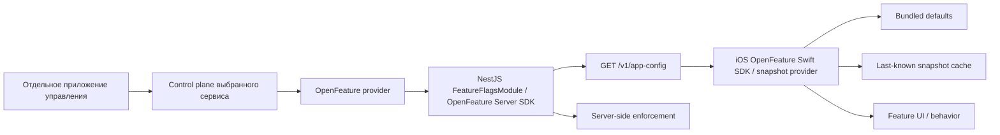

# Техническое задание: Feature Flags

Статус: `Draft 0.2`  
Стандарт и SDK: **OpenFeature — подтверждено**  
Control plane/provider: не выбран

## 1. Цель

Подсистема позволяет владельцу продукта из отдельного управляющего интерфейса:

- включать и выключать части функционала;
- постепенно раскатывать новую функцию;
- ограничивать функцию environment, платформой, версией приложения, locale или стабильной когортой;
- быстро выключать проблемный flow;
- в будущем проводить контролируемые эксперименты.

OpenFeature является обязательным API-слоем проекта. Выбор Flagsmith, Unleash, Flipt, flagd с собственным control plane, коммерческого сервиса или другой системы управления откладывается. Доменный код не должен зависеть от vendor SDK.

### 1.1 Что именно даёт OpenFeature

OpenFeature — бесплатная open-source спецификация и набор SDK под Apache 2.0. Это не SaaS, не отдельный сервер флагов и не готовая административная панель, поэтому его не требуется «хостить» как самостоятельный продукт.

Для полноценной подсистемы нужны два слоя:

1. **OpenFeature SDK** — единый API вычисления флагов в NestJS и iOS; подтверждён для проекта.
2. **Provider + control plane** — хранение правил, environments, интерфейс управления, аудит и доставка изменений; выбирается отдельно и может быть self-hosted.

Официальный OpenFeature-совместимый движок `flagd` можно развернуть самостоятельно, но он не содержит UI, persistence и management console. Поэтому `flagd` подходит только вместе с отдельным хранилищем и создаваемым нами управляющим приложением. Если требуется готовый self-hosted интерфейс, следует выбрать полноценную систему управления с OpenFeature provider.

## 2. Архитектура



Основной вариант — server-side evaluation:

1. Управляющее приложение изменяет flag в control plane.
2. NestJS OpenFeature provider получает/вычисляет значение для evaluation context.
3. iOS получает уже вычисленный snapshot через `/v1/app-config`, а локальный OpenFeature provider разрешает значения из snapshot/cache/defaults.
4. Backend отдельно применяет те же server-enforced flags к операциям API.

Преимущества:

- iOS не содержит management credentials;
- правила targeting не раскрываются клиенту;
- провайдера можно заменить в одном backend-модуле;
- одинаковая политика доступна iOS, Android и web;
- backend не доверяет скрытию UI.

Прямой vendor SDK на клиенте MAY быть добавлен позднее, если потребуется real-time streaming или client-side experimentation, но только как OpenFeature provider и за существующим `FeatureFlagProviding`.

## 3. Категории flags

### Release

Временное постепенное включение нового функционала.

Пример: `study.multiple_choice.enabled`.

### Operational / kill switch

Быстро выключает проблемную операцию.

Пример: `study.review_submission.enabled`.

### Experiment

Выбирает стабильный вариант и требует exposure + outcome analytics.

Пример: `home.recommended_decks.variant`.

### Remote configuration

Управляет небольшим типизированным параметром без нового binary.

Пример: `study.max_new_cards_per_session`.

Не следует превращать feature flags в произвольную удалённую БД. Большие колоды, тексты, факты и правила обучения имеют отдельные versioned контракты.

## 4. Что запрещено

Feature flag не может быть единственным механизмом для:

- доступа к чужим данным;
- ролей и permissions;
- платной подписки;
- проверки entitlement;
- удаления данных;
- миграции схемы;
- хранения токенов и секретов;
- юридического согласия;
- App Tracking Transparency;
- advertising eligibility, age/region policy или `ad_free` entitlement;
- совместимости API.

Клиент может быть модифицирован. Любая чувствительная проверка повторяется backend.

## 5. Registry

Каждый flag регистрируется в version control:

```json
{
  "key": "study.multiple_choice.enabled",
  "type": "boolean",
  "defaultValue": false,
  "category": "release",
  "activationPolicy": "nextSession",
  "serverEnforced": true,
  "owner": "learning",
  "description": "Enables objective multiple-choice sessions",
  "expiresAt": "2026-12-31"
}
```

Обязательные поля:

- стабильный `key`;
- `type`: boolean, string, number или строго описанный object;
- безопасный `defaultValue`;
- category;
- activation policy;
- server enforcement;
- owner;
- описание;
- дата пересмотра/удаления для временного flag.

Flag key не переиспользуется с другой семантикой.

## 6. Именование

Формат:

```text
<domain>.<feature>.<property>
```

Примеры:

- `study.multiple_choice.enabled`
- `study.session_size_20.enabled`
- `achievements.enabled`
- `content.coats_of_arms.enabled`
- `content.currencies.enabled`
- `home.recommended_decks.variant`
- `study.review_submission.enabled`
- `ads.enabled`
- `ads.home.bottom_banner.enabled`
- `ads.catalog.inline_native.enabled`
- `ads.session_result.interstitial.enabled`
- `ads.rewarded.optional_bonus.enabled`

Boolean key формулируется положительно. Двойное отрицание запрещено.

Для advertising flags:

- все bundled defaults равны `false`;
- category — `operational` или `release`;
- activation policy — `immediate`;
- глобальный `ads.enabled=false` выключает все placements;
- включённый flag не может обойти privacy/ATT, audience policy, frequency cap или entitlement;
- выключение flag прекращает новые load/present; уже открытый provider UI закрывается безопасно согласно возможностям SDK.

## 7. Defaults

Правила выбора default:

- ещё не выпущенная функция — `false`;
- стабильная основная функция — `true`;
- operational write path — значение, позволяющее работать в штатном режиме;
- эксперимент — control variant;
- неизвестный или неверно типизированный flag — registry default.

Bundled defaults являются частью клиента и backend. CI MUST проверять совпадение key/type/default для server-enforced flags или генерировать типизированный код из единого registry.

OpenFeature specification также строит evaluation вокруг обязательного default value и возврата default при ошибке provider. Это поведение принимается как требование проекта.

## 8. Activation policy

### `immediate`

Применяется во время работы приложения. Допустимо для аварийного выключения безопасно прерываемого функционала.

### `nextSession`

Значение фиксируется при создании учебной сессии и сохраняется в snapshot. Активная сессия не меняет mode/UI посередине.

### `nextLaunch`

Применяется после следующего запуска. Используется для крупных изменений навигации, persistence или composition.

Если flag меняется с `true` на `false`, текущая операция должна закончиться безопасно либо получить явный server response. Нельзя оставлять частично созданные данные.

## 9. Evaluation context

Allowlist:

- environment;
- platform;
- app version/build;
- OS major version при доказанной необходимости;
- locale;
- authenticated/guest;
- стабильный непрозрачный targeting key;
- явно согласованные cohort IDs.

Запрещено по умолчанию:

- email;
- Apple/Google subject;
- access/refresh tokens;
- имя;
- полная история review;
- точная геолокация;
- произвольный device fingerprint.

Для percentage rollout нужен стабильный targeting key:

- authenticated: service-scoped hash внутреннего user UUID;
- guest: случайный install ID;
- после входа допустима смена cohort, но новая assignment фиксируется в session/experiment exposure.

## 10. API snapshot

`GET /v1/app-config?platform=ios&appVersion=...&locale=...`

Пример:

```json
{
  "configVersion": "opaque-version",
  "generatedAt": "2026-07-27T12:00:00Z",
  "expiresAt": "2026-07-27T12:15:00Z",
  "featureFlags": {
    "study.multiple_choice.enabled": {
      "type": "boolean",
      "value": true,
      "variant": "enabled",
      "activationPolicy": "nextSession"
    },
    "home.recommended_decks.variant": {
      "type": "string",
      "value": "control",
      "variant": "control",
      "activationPolicy": "nextLaunch"
    }
  }
}
```

Требования:

- поддержка `ETag` / `If-None-Match`;
- cache TTL;
- public anonymous evaluation до login;
- повторная authenticated evaluation после login/logout;
- неизвестные клиенту keys безопасно игнорируются;
- неизвестный type/value не применяется;
- server may omit internal-only flags;
- client не получает targeting rules.

## 11. iOS FeatureFlagClient

### API

OpenFeature Swift SDK является обязательным механизмом evaluation. Наш `SnapshotOpenFeatureProvider` разрешает значения из полученного backend snapshot, кэша и встроенного registry. Feature-код использует типизированную обёртку и не импортирует API конкретного control plane:

```swift
protocol FeatureFlagProviding: Sendable {
    func boolValue(for key: BooleanFeatureFlag) -> Bool
    func stringValue(for key: StringFeatureFlag) -> String
    func numberValue(for key: NumberFeatureFlag) -> Double
    func refresh(context: FeatureFlagContext) async
}
```

### Resolution order

1. Валидный активный remote snapshot.
2. Последний валидный cached snapshot.
3. Bundled registry default.

Приложение не ждёт сеть для построения первого экрана.

### Storage

Кэш является несекретным:

- version;
- values;
- fetched/expires timestamps;
- context scope;
- checksum при необходимости.

Кэш разных account context не смешивается. UserDefaults допустим для небольшого snapshot; чувствительные данные туда не попадают.

### Runtime updates

- module публикует изменение через наблюдаемый state;
- feature root решает, применять ли значение согласно activation policy;
- активная study session хранит flag snapshot;
- не допускается каскадная перестройка навигации посередине пользовательского действия;
- при выключении функции экран показывает безопасный fallback, а не пустое состояние/crash.

### Debug

Debug/UITest builds MAY иметь локальные overrides и debug menu. Release build не содержит доступного пользователю override и не принимает launch arguments для production flags.

## 12. NestJS FeatureFlagsModule

Требования:

- provider-agnostic service;
- официальный OpenFeature Server SDK для Node.js;
- provider подключается через OpenFeature API и не вызывается бизнес-модулями напрямую;
- timeout и circuit breaker;
- типизированные accessors;
- registry validation;
- server-side enforcement guard/service;
- sanitization evaluation context;
- cache только с понятной consistency policy;
- provider failure не делает приложение целиком недоступным;
- structured evaluation details для diagnostics без PII;
- graceful provider initialization/shutdown;
- отдельная конфигурация на environment.

Пример server enforcement:

```ts
if (
  !(
    await flags.getBoolean(
      FeatureFlag.StudyMultipleChoiceEnabled,
      false,
      context,
    )
  ).value
) {
  throw new FeatureDisabledException(FeatureFlag.StudyMultipleChoiceEnabled);
}
```

Ошибка API:

```json
{
  "error": {
    "code": "FEATURE_DISABLED",
    "message": "This feature is temporarily unavailable",
    "requestId": "uuid",
    "details": {
      "feature": "study.multiple_choice"
    }
  }
}
```

Не следует отдавать внутреннее правило targeting или имя provider variation пользователю.

## 13. Управляющее приложение

Не входит в текущий backend/iOS MVP, но выбранный control plane должен позволять:

- отдельные dev/staging/production environments;
- RBAC;
- audit log;
- описание и owner;
- percentage rollout;
- targeting по allowlisted attributes;
- scheduled changes;
- быстрое rollback;
- approval для критических production flags;
- API/SDK для NestJS;
- экспорт или backup конфигурации.

Управляющее приложение не подключается напрямую к PostgreSQL основного продукта. Оно использует API выбранного flag service/control plane.

## 14. Lifecycle

1. Создать registry entry и безопасный default.
2. Выпустить код с выключенным release flag.
3. Проверить dev/staging.
4. Включить внутренней когорте.
5. Постепенно увеличить rollout.
6. Включить 100%.
7. Убедиться в стабильности.
8. Удалить старую ветку кода и flag.

Feature flag — временный инструмент, кроме явно постоянных operational flags. Expired flags отслеживаются CI/issue automation.

## 15. Аналитика

Для release flag простое чтение не создаёт analytics event.

Для эксперимента:

- exposure создаётся только когда пользователь реально увидел вариант;
- сохраняются flag key, variant, config version, experiment ID и timestamp;
- assignment стабилен;
- outcome events связываются с exposure без PII;
- один и тот же пользователь не должен хаотично менять вариант;
- эксперимент требует заранее заданной метрики.

## 16. Тестирование

### Unit

- remote → cached → default resolution;
- type mismatch;
- expired cache;
- context change;
- activation policies;
- unknown flag;
- provider timeout/error;
- server enforcement.

### Integration

- `app-config` anonymous/authenticated;
- `ETag` and 304;
- provider adapter swap;
- environment isolation;
- percentage rollout stability;
- backend и iOS используют одинаковые defaults.

### UI/E2E

1. Функция скрыта при `false`.
2. Функция появляется при `true`.
3. Активная сессия не меняется при `nextSession`.
4. Provider недоступен — приложение запускается.
5. Kill switch скрывает UI и backend возвращает `FEATURE_DISABLED`.
6. Смена guest → user обновляет context.
7. Debug override отсутствует в Release.

## 17. Definition of Done

- Есть version-controlled registry.
- NestJS использует OpenFeature Server SDK.
- iOS использует OpenFeature Swift SDK с нашим snapshot provider.
- iOS и backend используют типизированные keys.
- У каждого flag есть default, owner, category и activation policy.
- Provider скрыт за adapter.
- `app-config` поддерживает snapshot, cache metadata и ETag.
- iOS стартует без сети/provider.
- Server-enforced flags проверяются backend.
- Context не содержит запрещённую PII.
- Управляющие credentials отсутствуют в клиенте.
- Есть тесты fallback, lifecycle и enforcement.
- Документирован процесс создания, rollout, rollback и удаления flag.

## 18. Commerce и paid-decks флаги (PD-21)

Первые конкретные production flags поверх системы, описанной в разделах 1–17.
Бизнес-контекст: [17-paid-decks-storekit.md](./17-paid-decks-storekit.md) §10 и
[18-multi-content-paid-decks.md](./18-multi-content-paid-decks.md) §12 —
последний является единственным источником имён для обоих документов. Здесь
фиксируется то, что уже зарегистрировано в
`contracts/registries/feature-flags.json`.

Все семь — `boolean`, category `release`, `defaultValue: false` во всех средах
до rollout gate (документ 17 §20):

- `monetization.paid_decks.storefront_enabled` — общий rollout switch
  storefront и кнопки покупки, owner `monetization`, activation policy
  `immediate`;
- `commerce.apple_iap.enabled` — показ кнопки покупки Apple IAP на locked deck
  detail, owner `monetization`, `immediate`;
- `commerce.paid_decks.discovery.enabled` — показ платных колод в каталоге,
  owner `monetization`, `immediate`;
- `commerce.deck.europe_coats.enabled` — показ колоды European Coats, owner
  `monetization`, `immediate`;
- `commerce.deck.us_state_flags.enabled` — показ колоды U.S. State Flags,
  owner `monetization`, `immediate`;
- `content.coats_of_arms.enabled` — рендеринг card template гербов и
  связанного контента, owner `content`, `nextSession` — активная study-сессия
  не должна менять состав карточек посередине (раздел 8);
- `content.subdivisions.enabled` — рендеринг subdivision entities (штатов
  США) и связанного контента, owner `content`, `nextSession` по той же
  причине.

`commerce.deck.europe_coats.enabled` намеренно использует написание
`europe_coats` — как уже зафиксировано в entitlement key контрактов
(`contracts/fixtures/openapi/entitlements.json`,
`contracts/fixtures/openapi/commerce-offers.json`) и в issue #330, — а не
`european_coats` из §12 документа 18. Расхождение написания между документами
уже существует независимо от этого изменения (см. также §3.1 документа 17) и
не решается здесь.

### Инвариант: flag управляет rollout/discovery, не entitlement

Ни один флаг этого раздела не является исключением из §4 («доступа к чужим
данным», «проверки entitlement») — наоборот, он подтверждает эти запреты на
конкретном примере:

- при `false` owner (пользователь с активным `UserEntitlementGrant`)
  продолжает без деградации пользоваться уже купленной колодой;
- non-owner при `false` видит «Покупка временно недоступна», а не ошибку или
  пустой экран;
- канонический backend access guard (`access = FREE OR exists ACTIVE
  UserEntitlementGrant`, ADR-019, документ 17 §10) применяется одинаково при
  любом значении любого из этих флагов;
- ни при какой комбинации значений non-owner не получает доступ к платному
  контенту, а owner его не теряет.

Контрактная часть инварианта — что эти семь keys существуют и остаются
`boolean` с `defaultValue: false` — проверяется `validatePaidDecksRolloutFlags`
в `contracts/scripts/validate-json-schemas.mjs` и запускается вместе с
`yarn contracts:schemas`. Рантайм-часть — что backend access guard принимает
решение о доступе, не читая эти флаги — принадлежит коду guard'а (`backend/`,
PD-12 #321) и не покрывается тестами из `contracts/`.

## 19. Источники

- [OpenFeature: vendor-agnostic Flag Evaluation API](https://openfeature.dev/specification/sections/flag-evaluation/)
- [OpenFeature: назначение SDK и providers](https://openfeature.dev/docs/reference/intro/)
- [OpenFeature: официальный iOS SDK](https://github.com/open-feature/swift-sdk)
- [OpenFeature: официальный server SDK для JavaScript](https://openfeature.dev/docs/tutorials/getting-started/node/)
- [flagd: возможности и отсутствие management UI/persistence](https://flagd.dev/)
- [Apple: register default settings at launch](https://developer.apple.com/documentation/foundation/accessing-settings-from-your-code)
- [Apple UserDefaults security/storage notes](https://developer.apple.com/documentation/foundation/userdefaults)
