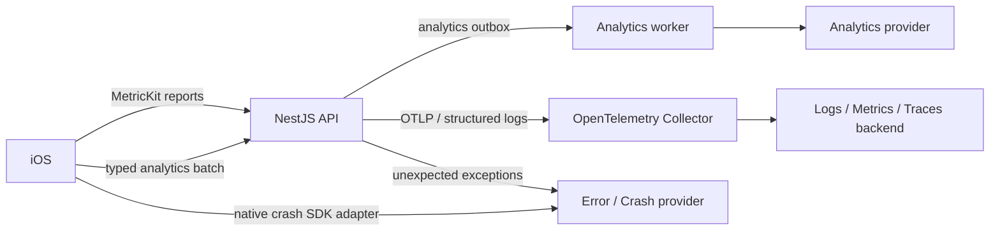

# Техническое задание: логирование, ошибки и аналитика

Статус: `Draft 0.1`  
Конкретные providers: не выбраны

## 1. Цель

Подсистема должна отвечать на разные вопросы:

- Что технически произошло? — logs.
- Где и почему упало приложение? — crash/error reporting.
- Насколько система доступна и быстра? — metrics.
- Через какие компоненты прошёл запрос? — distributed traces.
- Как пользователи работают с продуктом? — product analytics.

Эти данные нельзя смешивать в один бесконтрольный поток. Для каждого сигнала задаются отдельные schema, доступ, sampling, retention и privacy policy.

## 2. Архитектура



Решения:

- Backend traces и metrics SHOULD использовать OpenTelemetry.
- Backend application logs являются structured JSON и коррелируются с traces.
- iOS использует OSLog/`Logger` для локальных логов и MetricKit для системной диагностики.
- Product analytics с iOS идёт через собственный валидирующий batch endpoint.
- Native crash reporter MAY отправлять отчёты напрямую внешнему provider, но скрыт за протоколом.
- Конкретные сервисы выбираются отдельно без изменения feature-кода.

## 3. Термины

- **Expected error** — предусмотренный результат: validation, unauthorized, feature disabled, conflict.
- **Unexpected error** — дефект или инфраструктурный сбой, который не является штатным доменным исходом.
- **Fatal** — процесс или приложение не может безопасно продолжать работу.
- **Non-fatal** — операция завершилась ошибкой, но приложение продолжило работу.
- **Breadcrumb** — короткое очищенное событие перед ошибкой.
- **Product event** — типизированное событие пользовательского сценария.
- **Exposure** — пользователь реально увидел вариант feature flag/эксперимента.

## 4. Provider-agnostic интерфейсы

### Backend

- `ObservabilityService`
- `ErrorReporter`
- `AnalyticsExporter`
- OpenTelemetry-compatible tracer/meter
- structured logger adapter

### iOS

```swift
protocol AnalyticsTracking: Sendable {
    func track(_ event: AnalyticsEvent) async
    func setIdentity(_ identity: AnalyticsIdentity?) async
    func flush() async
}

protocol ErrorReporting: Sendable {
    func capture(error: Error, context: ErrorContext)
    func addBreadcrumb(_ breadcrumb: SafeBreadcrumb)
    func setUserContext(_ context: ErrorUserContext?)
}
```

Views и доменные сервисы не импортируют конкретный analytics/crash SDK.

## 5. Correlation

### Backend request

Каждый запрос получает:

- `requestId`;
- `traceId`;
- `spanId`;
- service;
- environment;
- release/version.

`X-Request-ID` возвращается клиенту. Trace context передаётся по стандартным заголовкам. Клиентский ID валидируется по длине/формату и не используется для security.

### iOS

Для API-error клиент хранит:

- endpoint template, без query secrets;
- HTTP status;
- server error code;
- `requestId`;
- локальный operation/session ID;
- app build;
- connectivity class.

Полные request/response bodies не прикладываются.

## 6. Backend structured logs

Минимальная запись:

```json
{
  "timestamp": "2026-07-27T12:00:00Z",
  "severity": "ERROR",
  "service": "country-flags-api",
  "environment": "production",
  "release": "api-1.2.3",
  "event": "review.batch_failed",
  "requestId": "uuid",
  "traceId": "hex",
  "errorCode": "DATABASE_TIMEOUT",
  "durationMs": 842
}
```

Правила:

- JSON в production;
- стабильный `event`, не свободный уникальный текст;
- exception stack только в защищённом error/log backend;
- PII redaction до export;
- один request не создаёт несколько одинаковых error records без причины;
- health-check success не засоряет production logs;
- SQL с параметрами/токенами не логируется целиком;
- slow query фиксируется с operation/table template, а не с пользовательскими значениями.

## 7. Уровни логов

- `debug` — локальная диагностика, выключена или sampled в production.
- `info` — запуск, миграция, завершение job, значимое штатное событие.
- `warn` — retry, fallback, provider degradation.
- `error` — unexpected failure операции.
- `fatal` — процесс не может продолжать работу.

Validation error и обычный `401` не являются `error`. Аномальный всплеск таких ответов отслеживается метрикой.

## 8. Backend error reporting

Central exception filter:

1. Классифицирует expected/unexpected.
2. Назначает стабильный public error code.
3. Генерирует/прикладывает `requestId` и `traceId`.
4. Редактирует response.
5. Отправляет unexpected exception в `ErrorReporter`.
6. Возвращает клиенту безопасный envelope.

Error report содержит:

- error class/fingerprint;
- stack;
- service/release/environment;
- request/trace IDs;
- safe tags;
- последние safe breadcrumbs;
- deployment/feature flag config version при необходимости.

Не содержит request body по умолчанию.

Source maps TypeScript и release metadata публикуются provider-у в CI.

## 9. Backend metrics

Минимальные:

- request count/duration/error rate;
- active requests;
- DB pool/connections;
- query latency;
- auth success/failure category;
- review accepted/duplicate/rejected;
- sync lag;
- scheduler replay duration;
- sessions started/completed;
- analytics outbox depth/oldest age/failures;
- feature flag provider latency/errors/default fallback;
- external provider latency/errors;
- process CPU/memory/event-loop lag;
- job duration/failure.

Metric labels имеют ограниченную cardinality. Запрещены:

- user ID;
- request ID;
- review/card/session UUID;
- raw URL;
- free-form error text.

Используются route template, status class, error code enum, provider enum и environment.

## 10. Distributed traces

Трассируются:

- HTTP lifecycle;
- database operations без значений параметров;
- external auth/provider calls;
- content import;
- review batch;
- scheduler replay;
- analytics export;
- background jobs.

Sampling:

- базовый production sampling конфигурируем;
- error и unusually slow traces SHOULD сохраняться;
- health endpoints исключаются или сильно sampled;
- trace export failure не ломает бизнес-операцию.

## 11. iOS local logging

Использовать `Logger`/OSLog:

```swift
logger.error("Sync failed: code=\(errorCode, privacy: .public) requestId=\(requestId, privacy: .private(mask: .hash))")
```

Категории:

- `network`
- `auth`
- `sync`
- `persistence`
- `study`
- `content`
- `featureFlags`
- `analytics`

По умолчанию interpolated values private. Public допустим для enum error code, app version и заранее безопасных констант.

Не логировать:

- tokens;
- email/provider subject;
- country answer text;
- полный URL с query;
- JSON body;
- Keychain;
- содержимое локальной БД.

## 12. iOS crash/non-fatal reporting

Требования:

- uncaught crashes;
- hangs;
- OOM/jetsam diagnostics, доступные через платформенные отчёты;
- selected non-fatal unexpected errors;
- release/build/environment;
- symbolication через dSYM;
- safe breadcrumbs;
- ограниченный opaque user context после разрешённой идентификации;
- reset user context при logout;
- rate limit/grouping повторов;
- offline persistence с лимитом и TTL;
- debug builds отделены от production.

Не отправлять каждую сетевую ошибку как non-fatal. Offline, timeout с успешным retry, validation и cancellation являются ожидаемыми outcomes и учитываются агрегированными метриками.

## 13. MetricKit

iOS MUST зарегистрироваться для MetricKit reports и обрабатывать:

- crash diagnostics;
- hang diagnostics;
- launch performance;
- CPU/memory;
- disk writes;
- network transfer;
- energy metrics, если доступны.

Payload:

- очищается;
- связывается с app build;
- ставится в ограниченную очередь;
- отправляется через diagnostics endpoint или approved provider adapter;
- не дублируется бесконечно.

MetricKit дополняет, а не заменяет real-time crash provider.

## 14. Product event registry

Каждое событие до реализации регистрируется:

```json
{
  "name": "study.session_completed",
  "schemaVersion": 1,
  "owner": "learning",
  "purpose": "Measure session completion and difficulty",
  "consentCategory": "product_analytics",
  "retentionClass": "product_standard",
  "properties": {
    "mode": "enum:self_rated|multiple_choice",
    "deckType": "enum:system|dynamic|custom",
    "requestedCardCount": "integer",
    "uniqueCardCount": "integer",
    "reviewCount": "integer",
    "durationBucket": "enum",
    "correctRateBucket": "enum"
  }
}
```

Registry проверяется CI. Неизвестный event/property отклоняется ingestion API.

## 15. Event envelope

```json
{
  "eventId": "uuid",
  "eventName": "study.session_completed",
  "schemaVersion": 1,
  "occurredAt": "2026-07-27T12:00:00Z",
  "anonymousId": "opaque-id",
  "sessionId": "opaque-analytics-session",
  "context": {
    "platform": "ios",
    "appVersion": "1.0.0",
    "build": "100",
    "locale": "ru",
    "featureConfigVersion": "opaque"
  },
  "properties": {
    "mode": "multiple_choice",
    "requestedCardCount": 10,
    "uniqueCardCount": 10,
    "reviewCount": 10,
    "durationBucket": "60_180s",
    "correctRateBucket": "80_89"
  }
}
```

Не отправлять точное время ответа/точный процент, если bucket достаточно для продуктовой задачи.

## 16. События MVP

### Product

- `onboarding.completed`
- `deck.opened`
- `study.session_started`
- `study.session_completed`
- `study.session_abandoned`
- `achievement.earned`
- `feature.exposed`
- `auth.completed`

### Operational client events

- `sync.completed`
- `content.update_completed`

Operational events не должны автоматически попадать в продуктовые funnels.

### Advertising events после фактического подключения provider

- `ad.requested`
- `ad.loaded`
- `ad.impression`
- `ad.clicked`
- `ad.dismissed`
- `ad.failed`
- `ad.reported`
- `ad.reward_verified`

Эти события не входят в MVP. Они используют отдельный `AdvertisingTelemetry` adapter и consent/purpose category. В основную аналитику не передаются IDFA, creative payload, targeting profile, provider token или произвольный SDK error message.

### Не отправлять как product analytics

- каждый `review`;
- конкретный неправильный ответ;
- свободный текст;
- каждое чтение feature flag;
- каждый screen render;
- raw exception message.

Canonical review history уже находится в основной БД. Нужные learning aggregates считаются там или формируются серверным privacy-aware job.

## 17. Analytics delivery

### iOS outbox

- UUID до enqueue;
- batch;
- offline;
- exponential backoff;
- TTL;
- maximum count/storage;
- consent filter;
- server per-event result;
- duplicate считается успехом;
- permanent rejection сохраняется только в bounded diagnostics.

Analytics никогда не блокирует переход между карточками или завершение сессии.

### Backend outbox

Domain event записывается в той же транзакции, что и доменное изменение, если потеря события критична для метрики.

Worker:

- at-least-once delivery;
- idempotency key;
- retry/dead-letter;
- provider mapping;
- lag metrics;
- удаление delivered records по TTL.

## 18. Identity

- `analyticsSubjectId` генерируется отдельно от user UUID.
- Email, Apple/Google subject и display name запрещены.
- Guest использует случайный anonymous install ID.
- При login выполняется единожды утверждённый alias/merge.
- При logout iOS очищает identified context и начинает новый anonymous session.
- Один пользователь на нескольких устройствах может объединяться только после auth.
- Account deletion вызывает provider delete API для identified analytics/error profiles.
- Уже агрегированные необратимо анонимные показатели MAY сохраняться согласно policy.

По умолчанию Advertising ID не используется, рекламный SDK отсутствует, а ATT prompt не показывается. Если будущий provider применяет cross-app tracking, это требует отдельного privacy/ATT решения и релиза. Отказ в ATT не может ограничивать core-функции; альтернативные идентификаторы и fingerprinting для обхода отказа запрещены.

## 19. Feature flag experiments

`feature.exposed` создаётся только когда пользователь реально увидел/использовал вариант:

- flag key;
- variant;
- config version;
- experiment ID;
- surface;
- timestamp.

Outcome события используют тот же experiment assignment. Простая evaluation flag без показа не считается exposure.

Assignment должен быть стабильным для пользователя/гостя в рамках эксперимента.

## 20. Consent и privacy

До production необходимо определить применимую consent policy по регионам с юристом.

Архитектура поддерживает:

- `UNKNOWN`
- `GRANTED`
- `DENIED`
- `NOT_REQUIRED`

Категории:

- essential service observability;
- crash diagnostics;
- optional product analytics;
- experiments.
- contextual advertising measurement;
- personalized advertising/tracking — только после отдельного решения.

При `DENIED` optional события не ставятся в очередь, ранее ожидающие удаляются, provider identity сбрасывается. Серверные security/audit logs живут по отдельной обязательной policy.

Privacy Policy и App Store privacy labels описывают crash data, performance data, product interaction, advertising data и identifiers, если они реально собираются приложением или third-party SDK. Выключенный feature flag не освобождает от раскрытия поведения SDK, включённого в binary.

## 21. Data minimization и redaction

Общий denylist:

- access/refresh/identity tokens;
- authorization headers/cookies;
- passwords/secrets;
- email;
- provider subject;
- push token;
- точная геолокация;
- IP после инфраструктурной обработки, если не нужен;
- свободный ответ;
- полные request/response bodies;
- Keychain/local DB content.

Redaction выполняется до network export. Provider-side scrubbing является вторым уровнем, а не единственной защитой.

Автотесты подставляют canary secrets/PII и проверяют отсутствие в exported payload.

## 22. Retention

Перед production утверждается таблица:

- signal/category;
- purpose;
- raw retention;
- aggregate retention;
- lawful/consent basis;
- provider;
- deletion mechanism;
- owner.

Начальная техническая рекомендация:

- production application logs: 14–30 дней;
- raw traces: 7–14 дней;
- error reports: 90 дней;
- product events: не более 13 месяцев без нового обоснования;
- delivered outbox: минимальный TTL;
- необратимые aggregates: отдельно утверждённый срок.

Значения не зашиваются в iOS и могут быть сокращены.

## 23. Dashboards и alerts

### Backend

- availability;
- p50/p95/p99 latency;
- 5xx/error code;
- DB pool;
- auth failure spike;
- review/sync rejection;
- scheduler replay;
- queue lag;
- feature provider errors.

### iOS

- crash-free users/sessions;
- hang rate;
- launch time;
- app version adoption;
- sync failure;
- content update failure;
- error groups by release.

### Product

- onboarding completion;
- first session start/completion;
- session completion by size/mode;
- D1/D7 return where privacy policy permits;
- deck usage;
- achievement progression;
- objective test adoption;
- feature experiment outcomes.

Alerts создаются по impact и устойчивому отклонению, а не по каждой отдельной ошибке.

## 24. CI/CD

- source maps/dSYM upload;
- release/version tag;
- environment separation;
- telemetry schema validation;
- PII canary test;
- analytics registry compatibility;
- provider credentials only in secrets manager;
- test events маркируются environment и не попадают в production reports;
- deployment marker отправляется observability/error provider.

## 25. Критерии выбора providers

### Error/crash reporting

- native iOS crash и hang collection;
- dSYM symbolication;
- TypeScript source maps;
- release health и regression detection;
- non-fatal grouping/fingerprints;
- PII scrubbing до и после export;
- deletion API;
- region/data residency options;
- RBAC, audit и SSO;
- predictable pricing.

### Product analytics

- server-side ingestion и batch;
- event schema/governance;
- idempotency или deduplication;
- anonymous→identified alias;
- delete/export API;
- consent support;
- funnels, retention и cohorts;
- feature experiment exposure;
- EU/data residency или self-hosting, если потребуется;
- export сырых данных без vendor lock-in.

### Logs/metrics/traces

- OTLP ingestion/export;
- корреляция logs/traces;
- alerting и dashboards;
- sampling/retention controls;
- cardinality protection;
- sensitive-field redaction;
- SLO/error-budget support;
- стоимость ingestion/storage.

На первом этапе SHOULD использоваться готовый dashboard выбранных providers. Создание собственного интерфейса наблюдаемости не входит в MVP.

## 26. Тестирование

### Unit

- error classification;
- redaction;
- analytics schema;
- consent filter;
- identity reset;
- outbox retry/TTL;
- feature exposure;
- metric labels cardinality guard.

### Integration

- request/trace/log correlation;
- exception reporting;
- client event ingestion;
- duplicate event;
- provider unavailable;
- analytics exporter retry;
- account deletion propagation;
- dSYM/source map release mapping.

### E2E

1. Complete session → один `study.session_completed`.
2. Retry batch → duplicate без второй аналитической доставки.
3. Logout → identified context очищен.
4. Deny analytics → optional event не отправлен.
5. Crash build → symbolicated report с release.
6. Backend exception → безопасный response + correlated error.
7. Canary token/email отсутствует во всех exported payload.
8. Feature shown → exposure; flag read without display → no exposure.

## 27. Definition of Done

- Разделены logs, errors, metrics, traces и product analytics.
- Providers скрыты за adapters.
- Backend имеет structured logs и OpenTelemetry traces/metrics.
- iOS использует OSLog и MetricKit.
- Crash/non-fatal reports symbolicated.
- Request ID/trace ID коррелируются.
- Analytics registry versioned и проверяется CI.
- Client/backend outbox идемпотентны.
- Consent и identity lifecycle протестированы.
- PII denylist и redaction применяются до export.
- Account deletion распространяется на providers.
- Есть dashboards, alerts, retention table и owner для каждого сигнала.

## 28. Источники

- [OpenTelemetry JavaScript](https://opentelemetry.io/docs/languages/js/)
- [OpenTelemetry Logs Data Model](https://opentelemetry.io/docs/specs/otel/logs/data-model/)
- [OpenTelemetry Metrics and cardinality](https://opentelemetry.io/docs/concepts/signals/metrics/)
- [Apple Logger and privacy-aware interpolation](https://developer.apple.com/documentation/os/logger)
- [Apple OSLogPrivacy](https://developer.apple.com/documentation/os/oslogprivacy)
- [Apple MetricKit](https://developer.apple.com/documentation/metrickit)
- [Apple App Privacy Details](https://developer.apple.com/app-store/app-privacy-details/)
