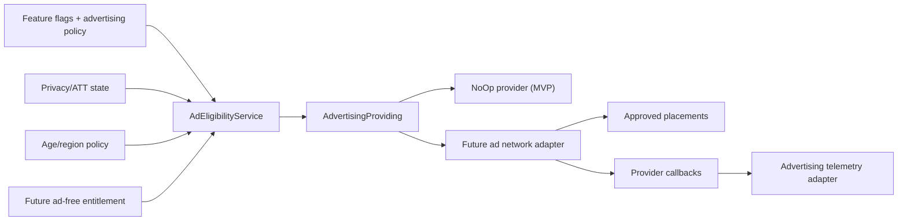

# Техническое задание: опциональная реклама

Статус: `Draft 0.1`  
Включение рекламы: не подтверждено  
Рекламный provider: не выбран

## 1. Цель и границы

Архитектура должна позволять добавить рекламу после MVP без:

- переписывания экранов и доменной логики;
- прямой зависимости feature-кода от рекламного SDK;
- нарушения обучения, прогресса или синхронизации;
- обязательного cross-app tracking;
- обязательного запроса App Tracking Transparency;
- добавления рекламного SDK до выбора provider и privacy-аудита.

В MVP реализуется `NoOpAdvertisingProvider`, registry рекламных placements, policy/eligibility layer и feature flags. Реальный SDK, рекламные блоки и монетизация не входят в MVP и подключаются отдельным релизом.

## 2. Базовые продуктовые решения

Если реклама будет активирована, начальная модель:

- контекстная/неперсонализированная реклама;
- без IDFA и fingerprinting;
- без рекламы внутри активной учебной сессии;
- без блокировки core-функций;
- без влияния на FSRS, mastery, правильность ответов и достижения;
- с ограничением частоты;
- с мгновенным удалённым kill switch;
- с возможностью будущего entitlement `ad_free`.

Персонализированная реклама, rewarded ads и interstitial являются отдельными продуктовыми решениями, а не автоматическим продолжением интеграции SDK.

## 3. Архитектура



Feature-код работает только с `AdvertisingProviding` и `AdPlacement`. Конкретный SDK импортируется исключительно внутри provider adapter.

Feature flag не является достаточным privacy-механизмом: выключенный UI-флаг не отменяет возможный сбор данных уже инициализированным SDK. Рекламный SDK нельзя инициализировать до успешной проверки eligibility/privacy policy.

Android и web в будущем используют те же стабильные placement keys и advertising policy API, но собственные platform adapters и consent-механизмы. Provider и разрешённые форматы MAY различаться по платформе; iOS ATT нельзя переносить как универсальную модель согласия на Android/web.

## 4. Registry placements

Каждое место показа регистрируется в version control:

```json
{
  "key": "home.bottom_banner",
  "format": "BANNER",
  "defaultEnabled": false,
  "featureFlag": "ads.home.bottom_banner.enabled",
  "activationPolicy": "immediate",
  "allowedSurfaces": ["HOME"],
  "owner": "monetization",
  "description": "Optional contextual banner below home content"
}
```

Поддерживаемые форматы архитектуры:

- `BANNER`;
- `NATIVE`;
- `INTERSTITIAL`;
- `REWARDED`.

Наличие enum не означает разрешение формата к выпуску.

Предварительные placements:

- `home.bottom_banner`;
- `catalog.inline_native`;
- `session_result.interstitial`;
- `rewarded.optional_bonus`.

Каждый placement требует отдельного продуктового и privacy approval перед включением.

## 5. Запрещённые поверхности

Реклама MUST NOT показываться:

- между лицевой и обратной стороной карточки;
- между вопросом и выбором ответа;
- посередине активной учебной сессии;
- на экранах авторизации;
- в privacy/consent flow;
- при удалении аккаунта или прогресса;
- на экране системной/сетевой ошибки;
- в onboarding до получения пользователем основной ценности;
- в push notifications, widgets, extensions или App Clips;
- пользователю с активным `ad_free` entitlement;
- когда policy запрещает рекламу для аудитории/региона.

Interstitial MAY быть рассмотрен только после полного отображения результата сессии. Он не может скрывать результат, мешать сохранению progress или создавать впечатление обязательного шага. Должны быть явно видны признак рекламы и доступная кнопка закрытия/пропуска.

## 6. Eligibility

Единое решение принимает `AdEligibilityService`.

Показ разрешён только если одновременно:

1. глобальный `ads.enabled = true`;
2. flag конкретного placement включён;
3. placement разрешён текущей advertising policy;
4. выбран и успешно инициализирован provider;
5. выполнены применимые privacy/consent требования;
6. формат соответствует текущей age/region policy;
7. у пользователя нет `ad_free` entitlement;
8. frequency cap не исчерпан;
9. текущий UI state допускает безопасный показ.

Если любой пункт неизвестен, реклама не показывается. Core UI продолжает работу.

## 7. Frequency caps

Advertising policy должна поддерживать:

- минимальное число завершённых сессий до первого показа;
- минимальный интервал между interstitial;
- максимум показов одного placement за сессию;
- дневной максимум;
- cooldown после dismiss/error;
- отдельные параметры для anonymous/authenticated пользователей.

Начальные безопасные defaults:

- все placements выключены;
- interstitial — не ранее чем после нескольких завершённых учебных сессий;
- не более одного interstitial за app session;
- banner/native не меняет размер критического UI после появления;
- provider error/no-fill не вызывает немедленный бесконечный retry.

Конкретные числовые лимиты утверждаются экспериментом до включения и приходят как типизированная remote configuration. Клиент имеет более строгие bundled limits и применяет минимум из remote и local safety limit.

## 8. iOS API

```swift
protocol AdvertisingProviding: Sendable {
    func prepare(context: AdvertisingContext) async
    func load(_ placement: AdPlacement) async -> AdLoadResult
    @MainActor
    func present(_ placement: AdPlacement, from host: AdPresentationHost) async -> AdPresentationResult
    func reset() async
}
```

Дополнительные компоненты:

- `NoOpAdvertisingProvider`;
- `AdEligibilityService`;
- `AdPlacementRegistry`;
- `AdFrequencyCapStore`;
- `AdvertisingPrivacyCoordinator`;
- `AdvertisingTelemetry`;
- будущий provider adapter.

Требования:

- `NoOpAdvertisingProvider` является production-safe default;
- отсутствие provider/no-fill/error не отображается как пользовательская ошибка;
- зарезервированный banner slot схлопывается без пустого блока;
- load/present не блокирует сохранение review, завершение сессии или навигацию;
- provider reset выполняется при logout, отзыве consent и смене account context;
- provider user/device identifiers не передаются в основную продуктовую аналитику;
- локальный frequency cap не является security-границей, но защищает UX;
- рекламный SDK не импортируется в View/ViewModel.

## 9. ATT, consent и privacy

Начальный режим — контекстная реклама без cross-app tracking. Приложение не показывает ATT prompt «на всякий случай».

Если в будущем потребуется tracking:

1. проводится отдельный privacy/legal review;
2. документируется набор данных и цель;
3. обновляются Privacy Policy, App Store privacy details и privacy manifests;
4. пользователь получает прозрачное объяснение;
5. системное разрешение запрашивается через App Tracking Transparency;
6. core-функциональность не блокируется и пользователь не вознаграждается за согласие;
7. при отказе используется контекстная реклама либо реклама отключается;
8. альтернативные идентификаторы и fingerprinting для обхода отказа запрещены.

Нужно различать:

- OS-level ATT status;
- региональное privacy/consent решение;
- разрешение на optional product analytics;
- advertising personalization;
- eligibility самого placement.

Эти состояния нельзя сводить к одному boolean.

## 10. Детская аудитория

До решения об аудитории реклама считается выключенной для child-directed/Kids Category режима.

Если продукт будет позиционироваться как детский:

- проводится отдельный legal/App Store review;
- сторонняя поведенческая реклама запрещается;
- допустимость даже контекстного provider проверяется отдельно;
- creatives должны соответствовать возрастному рейтингу и требованиям human review;
- рекламный SDK не должен передавать persistent identifiers или другую запрещённую информацию.

Нельзя определять ребёнка через скрытый profiling. Возрастная/региональная policy должна иметь явное законное основание и минимизировать данные.

## 11. Выбор provider

Перед добавлением SDK provider проходит review:

- поддержка contextual/non-personalized ads без IDFA;
- документированное поведение до/после ATT;
- data inventory, retention и deletion;
- privacy manifest и подпись SDK;
- отсутствие fingerprinting;
- возрастные ограничения и фильтрация creatives;
- возможность пожаловаться на неподходящую рекламу;
- banner/native/interstitial/rewarded formats;
- frequency cap и no-fill behavior;
- test mode;
- стабильный Swift Package Manager distribution;
- release notes и security response;
- предсказуемые комиссии/выплаты;
- поддержка нужных стран;
- server callback/verification для rewarded ads;
- export revenue/impression data без передачи лишней PII.

Добавление SDK требует ADR, dependency review и обновления App Store disclosures даже при выключенном feature flag.

## 12. Backend

NestJS не выдаёт рекламные creatives и не проксирует обычные ad requests. Его задачи:

- сформировать server-evaluated advertising policy;
- учитывать будущий `ad_free` entitlement;
- отдать безопасную policy через `/v1/app-config`;
- предоставить feature flags/kill switch;
- принимать только утверждённые агрегированные telemetry events;
- в будущем проверять rewarded callback/idempotency.

Пример фрагмента `/v1/app-config`:

```json
{
  "advertising": {
    "policyVersion": "ads-policy-v1",
    "enabled": false,
    "mode": "CONTEXTUAL_ONLY",
    "placements": {
      "home.bottom_banner": {
        "enabled": false,
        "format": "BANNER"
      }
    },
    "refreshAfter": "2026-07-27T12:15:00Z"
  }
}
```

Management credentials, provider secrets и targeting rules клиенту не передаются. Публичные ad unit identifiers MAY находиться в environment-specific client configuration после выбора provider.

Rewarded ads, если будут добавлены:

- не влияют на mastery/FSRS/объективную правильность;
- reward определяется allowlisted server rule;
- callback проверяется по подписи provider;
- используется idempotency key;
- клиентский callback сам по себе не выдаёт ценность;
- повторная доставка callback не дублирует reward.

## 13. Feature flags

Минимальный registry:

- `ads.enabled`;
- `ads.home.bottom_banner.enabled`;
- `ads.catalog.inline_native.enabled`;
- `ads.session_result.interstitial.enabled`;
- `ads.rewarded.optional_bonus.enabled`.

Все defaults — `false`, category — `operational` или `release`, activation policy — `immediate`.

Feature flags не заменяют:

- ATT;
- consent;
- age/region policy;
- entitlement;
- provider initialization policy;
- App Store disclosure.

## 14. Телеметрия

Отдельный `AdvertisingTelemetry` adapter MAY принимать:

- `ad.requested`;
- `ad.loaded`;
- `ad.impression`;
- `ad.clicked`;
- `ad.dismissed`;
- `ad.failed`;
- `ad.reported`;
- `ad.reward_verified`.

События имеют schema version, placement, format, provider enum, result/error code и coarse timing. Запрещены:

- IDFA или другой advertising/device identifier в основной аналитике;
- creative payload/URL;
- provider token;
- точный targeting profile;
- email/user ID/provider subject;
- произвольный SDK error message;
- дублирование сырого provider event stream без цели и retention policy.

Ad revenue/impression data считается отдельной категорией advertising data и должно быть отражено в privacy inventory. Product analytics и provider reporting могут иметь разную методику; источник финансовой истины задаётся отдельно.

## 15. UX и accessibility

- Реклама визуально обозначена.
- Close/skip доступен VoiceOver и имеет достаточную область нажатия.
- Dynamic Type не перекрывает рекламой core controls.
- Reduce Motion учитывается для наших transition, насколько это возможно.
- Поворот экрана/возврат из background не создаёт повторный impression.
- Ошибка загрузки не оставляет пустую модальную поверхность.
- Пользователь имеет доступный способ сообщить о неподходящей или возрастно неприемлемой рекламе.

## 16. Тестирование

### Unit

- eligibility для каждого запрещающего условия;
- all defaults off;
- entitlement disables ads;
- consent/ATT transition;
- frequency cap;
- no-fill/error fallback;
- logout/reset;
- telemetry redaction;
- rewarded idempotency contract.

### Integration

- `/v1/app-config` advertising policy;
- feature flag kill switch;
- policy cache/expiry;
- provider не инициализируется до eligibility;
- denied tracking не вызывает tracking requests;
- ad-free entitlement побеждает remote flag;
- unknown placement/format безопасно игнорируется.

### UI

- активная study session не содержит рекламы;
- banner placeholder корректно схлопывается;
- interstitial не закрывает session result;
- close/skip работает с VoiceOver;
- provider unavailable не ломает экран;
- inappropriate-ad reporting доступен;
- NoOp provider проходит весь core flow.

## 17. Definition of Done для архитектурной подготовки

- В iOS есть `AdvertisingProviding` и `NoOpAdvertisingProvider`.
- Есть типизированный placement registry.
- Eligibility объединяет flags, privacy, policy и будущий entitlement.
- Все advertising flags по умолчанию выключены.
- Core domain и View не импортируют рекламный SDK.
- `/v1/app-config` допускает versioned advertising policy.
- Активная учебная сессия является ad-free.
- Телеметрия рекламы отделена от основной аналитики.
- Выбор SDK требует отдельного ADR/privacy review.
- Release без рекламного SDK не показывает ATT prompt и не заявляет несуществующий tracking.

## 18. Источники

- [Apple App Review Guidelines](https://developer.apple.com/app-store/review/guidelines/)
- [Apple: User Privacy and Data Use / ATT](https://developer.apple.com/app-store/user-privacy-and-data-use/)
- [Apple: App Privacy Details](https://developer.apple.com/app-store/app-privacy-details/)
- [Apple: Privacy manifest files](https://developer.apple.com/documentation/bundleresources/privacy-manifest-files)
- [Apple: Third-party SDK requirements](https://developer.apple.com/support/third-party-SDK-requirements/)
